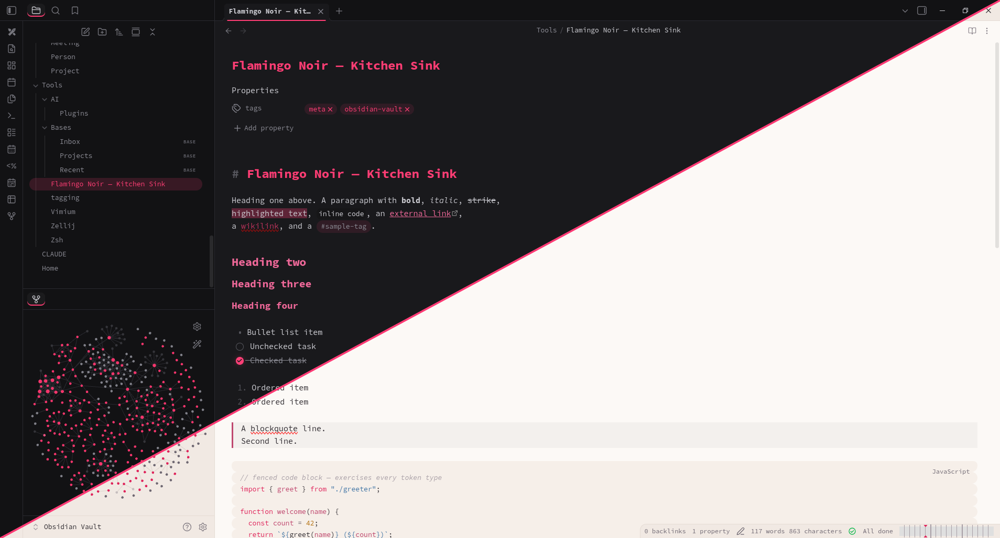

# Flamingo Noir

A bold, monospaced theme for Obsidian: a monochrome hot-pink accent on
near-black, a deep-rose second accent, and an art-directed warm-paper light
mode. Square left-bar callouts, an underline tab indicator, themed syntax
highlighting, and a styled graph view — in both dark and light modes.

## Install

- **Community directory** (once accepted): Settings → Appearance → Manage, then
  search for *Flamingo Noir*.
- **Manual:** create a folder named `Flamingo Noir` in
  `<your vault>/.obsidian/themes/`, copy `manifest.json` and `theme.css` from
  this repository into it, then select it under Settings → Appearance → Themes.
- **BRAT:** add `jackMort/flamingo-noir` in the BRAT community plugin.

## Design

- **Hot pink** (`#FF3B75`) — H1 headings, primary buttons, the active-tab
  underline, tags.
- **Rose** (`#F0689A`) — H2–H6 headings, links, the blockquote bar.
- **Callouts** — square cards with a left accent bar: pink for note/info/tip,
  orange for warnings, rose for danger/quote.
- **Code** — keywords pink, functions rose, strings blue, numbers amber,
  comments faint italic; covers both reading view and Live Preview.
- A fully art-directed **light mode** — a warm paper background, not a
  mechanical inverse of the dark palette.

## Fonts

The theme sets a `Source Code Pro` monospace stack with fallbacks
(`ui-monospace, SF Mono, Menlo, Consolas, monospace`). Installing
[Source Code Pro](https://fonts.google.com/specimen/Source+Code+Pro) gives the
intended look but is optional — the fallback stack is used automatically. Fonts
can be overridden in Settings → Appearance.

## License

[MIT](LICENSE) © Lech Twaróg
